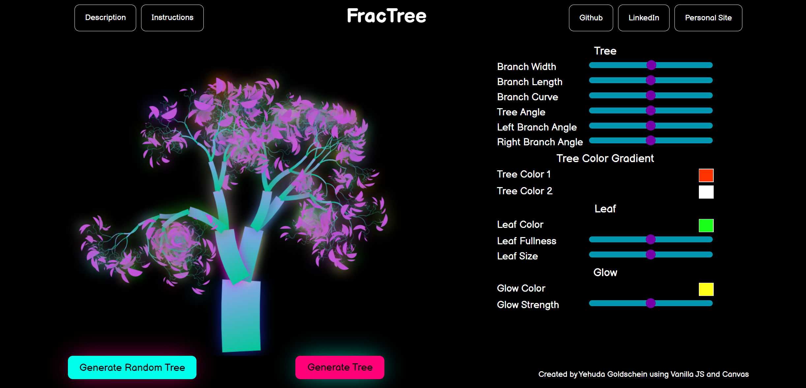
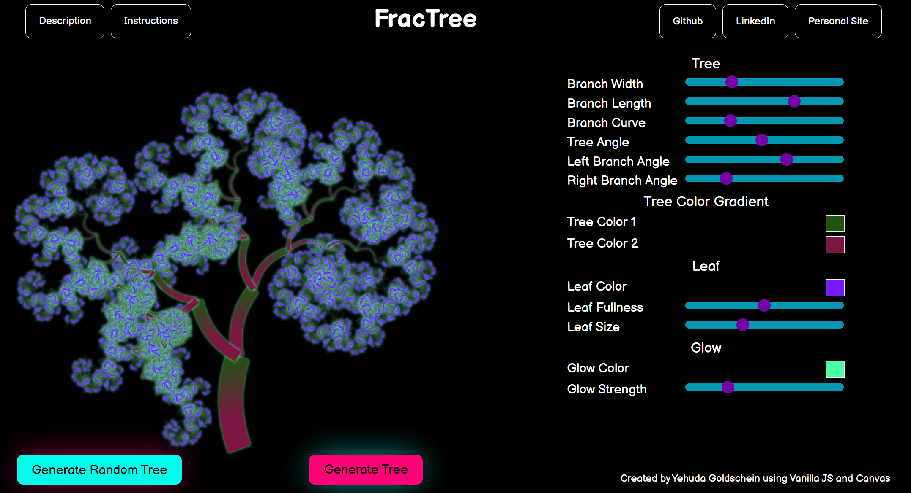

# FracTree

## About

*[FracTree](https://yudagn.github.io/FracTree/)* is a fun visualization of fractals generated in the form of trees.

## Functionality and MVPs

In FracTree, the user is able to: 

- Generate a fractal tree.
- Adjust many different variables that factor into the generation of the fractal tree using sliders.
- Generate a random fractal tree

In addition, the following is included:

- A modal of instructions on how to affect the tree
- A modal with an explanation on what a fractal is and how the vizualizer works
- Personal Links



## Highlights

The main function in the generation of the tree is a recursive function that generates the branches of the tree over and over, changing the size of the branch

``` Javascript
genTree() {
    this.ctx.clearRect(0, 0, this.canvas.width, this.canvas.height);
    this.drawTree(
      this.ctx,
      this.X,
      this.Y,
      this.length,
      this.angle,
      this.branchWidth,
      this.treeColor,
      this.leafColor
    );
  }

```

``` Javascript
drawTree(
    ctx,
    startX,
    startY,
    length,
    angle,
    branchWidth,
    leafColor,
    branchColor1,
    branchColor2
  ) {

    new RandomBranch(
      ctx,
      startX,
      startY,
      length,
      angle,
      branchWidth,
      branchColor1,
      branchColor2
    );

    if (length < 10) {
      new RandomLeaf(ctx, length, leafColor);
      return;
    }

    const angleChange1 = Math.random() * 25 + 5;
    const angleChange2 = Math.random() * 25 + 5;

    let newBranchWidth;
    if (branchWidth * 0.5 < 0.3) {
      newBranchWidth = 0.3;
    } else {
      newBranchWidth = branchWidth * 0.5;
    }

      this.drawTree(
        ctx,
        0,
        -length,
        length * 0.75,
        angle + angleChange1,
        newBranchWidth,
        leafColor,
        branchColor1,
        branchColor2
      );

      this.drawTree(
        ctx,
        0,
        -length,
        length * 0.75,
        angle - angleChange2,
        newBranchWidth,
        leafColor,
        branchColor1,
        branchColor2
      );

      ctx.restore();

  }

```

## Technologies

This project uses Vanilla JS and Canvas.
